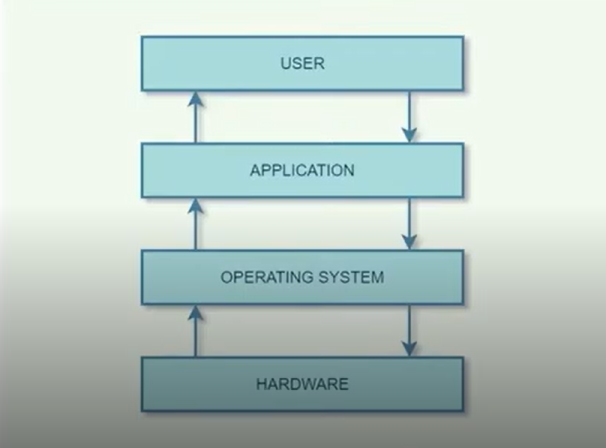
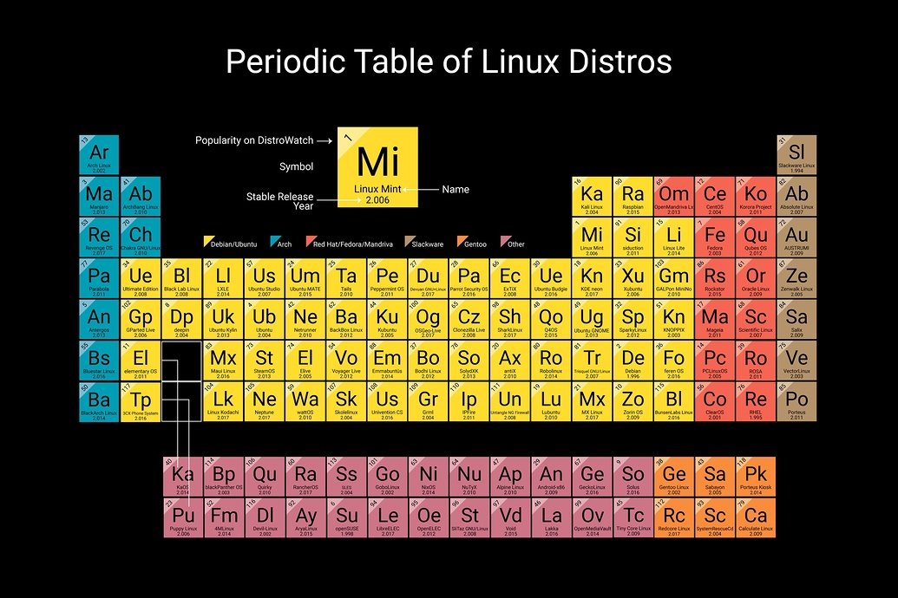

# Trabalhando com Sistemas Operacionais

## Conceito Base 

O sistema operacional é um **software** que atua como **intermediário entre o usuário e o hardware** do computador. São responsáveispor traduzir as entradas do usuário para a linguagem de máquina, formando uma **interface**, como também traduzir para o usuário as saídas geradas pelo hardware. 

### Funções
- Gerenciamento de processos
- Gerenciamento de memória
- Gerenciamento de dispositivos
- Gerenciamento de arquivos
- Segurança
- Detecção de erros
- Agendamento de tarefas

### Recursos
- Fornece uma plataforma para executar aplicativos
- Gerenciamento de memória e CPU
- Fornece abstração de sistema de arquivos
- Fornce suporte de rede
- Fornce recursos de segurança
- Fornece interface de usuário
- Fornece utilitários e serviços de sistema
- Suporte ao desenvolvimento de aplicativos

### Componentes
- **Shell**: trata das interações do usuário, sendo a camada mais externa do sistema operacional e gerencia a interação entre usuários e sistema operacional. 
  **Funções**:
  - Solicitar entradas do usuário
  - Interpretar a entrada para o SO
  - Manipular a saída do SO
- **Kernel**: é o componente central de um SO, do qual todos os outros componentes do sistema dependem para fornecer serviços essenciais, atuando como interface principal entre o SO e o hardware. 
  **Funções**:
  - Gerenciamento de input-output
  - Gerenciamento de memória
  - Gerenciamento de processos para execução de aplicativos
  - Gerenciamento de dispositivo
  - Controle de chamadas do sistema

## Exemplos de SO's
- [Microssoft Windows](#microssoft-windows) 🪟
- macOS 🍎
- [Linux](#sos-baseados-em-linux) 🐧
- Android 🤖

## Microssoft Windows
Windows é o principal sistema operacional da Microssoft, o padrão de fato para computadores domésticos e empresariais. É baseado na **interface gráfica do usuário (GUI)**, introduzido em 1985 e foi lançado em várias versões. A principal linguagem de programação do código-fonte das várias versões do Windows é o **C** e em algumas partes com **C++** e **Assembly**.
> **C#** é derivada de C++ e propriedade da Microssoft, também muito utilizada para desenvolvimento de aplicações windows.

- Até a versão 3.11, rodava em 16 bits (com um update chamado Win32s adicionando suporte a 32 bits).
- As versões a partir do XP e Server 2003 estão preparadas para a tecnologia 64 bits.
  
Devido a sua grande popularidade, o Windows é um grande alvo de ameaças cibernéticas.

### Exemplos de virus para Windows nos anos 90 a 2000
- `WinNT.Remote Explorer`:
  - **Tipo**: Cavalo de Troia/backdoor para Windows NT.
  - **Comportamento**: Permitindo controle remoto do sistema infectado.
  - **Impacto**: Usado para espionagem e roubo de dados corporativos.
  - **Nota**: Foi um dos primeiros exemplos de malware voltado para ambientes corporativos NT, explorando   vulnerabilidades de rede.
- `WinNT.Infis`:
  - **Tipo**: Vírus parasita para Windows NT.
  - **Comportamento**: Infectava executáveis e podia se propagar em sistemas NT.
  - **Impacto**: Menos famoso que outros, mas representava a transição de vírus simples para ataques mais sofisticados em ambientes profissionais.
  - **Nota**: Pouco documentado, mas conhecido por explorar falhas específicas do NT.
- `Win95.CIH`:
  - **Tipo**: Vírus parasita extremamente destrutivo.
  - **Comportamento**: Infectava arquivos executáveis sem aumentar seu tamanho.
  - **Payload**:
    - **Data de ativação**: 26 de abril (aniversário do desastre de Chernobyl).
    - **Ações**:
      - Sobrescrevia o disco rígido com dados aleatórios.
      - Tentava sobrescrever o Flash BIOS, inutilizando a placa-mãe.
  - **Impacto**: Um dos vírus mais devastadores da história, capaz de tornar o PC inutilizável sem reparo físico.
- `Win32.Kriz`:
  - **Tipo**: Vírus para Windows 95/98/NT.
  - **Comportamento**: Infectava executáveis PE (Portable Executable).
  - **Payload**:
    - Ativava em datas específicas (25 de dezembro).
    - Podia apagar dados e corromper o BIOS, semelhante ao CIH.
  - **Impacto**: Menos difundido que o CIH, mas igualmente perigoso por atacar o BIOS.
- `Win95.Babylonia`:
  - **Tipo**: Vírus para Windows 95.
  - **Comportamento**: Executava ações arbitrárias do invasor, como alterar arquivos, modificar configurações e causar lentidão.
  - **Sintomas**:
    - Desempenho lento.
    - Alterações na área de trabalho.
    - Congelamentos e perda de espaço em disco.
  - **Impacto**: Menos destrutivo que CIH ou Kriz, mas causava instabilidade e perda de dados.

### Prevenção
- Manter as atualizações do SO em dia
- Utilizar um bom antivirus
- Cuidado e bom senso com o que acessa

## SO's baseados em Linux
### Antecedente
- O SO **Unix** implementado em 1969 por Ken Thompson, Dennis Ritchie, Douglas Mcllory e Jow Ossanna.
- Lançado em 1971, era escrito em **Assembly**
- Em 73 foi reescrito na linguagem **C por Dennis**
> Dennis Ritchie é considerado o pai da linguagem C

O Kernel do Linux foi, originalmente, escrito por **Linus Torvalds** do departamento de Ciência da Computação da Universidade de Helsinki, Finlândia, com a ajuda de vários programadores voluntários através da Usenet. 
Porém em uma definição mais profunda e técnica, **Linux é o nome dado apenas ao núcleo do sistema operacional, o Kernel** e os SO's que utilizam esse Kernel são as **Distros**. 

### Vulnerabilidades do Linux
O nível de risco da vulnerabilidade é definido pelo Common Vulnerability Scoring System (CVSS Scores) com uma representação numérica (0-10).

- **CVE-2022-0435 (CVSS Score: 9.0)**: Vulnerabilidade crítica no kernel do Linux relacionada ao módulo SCTP (Stream Control Transmission Protocol). Permite execução remota de código e potencial negação de serviço.
- **CVE-2022-0492 (CVSS Score: 7.8)**: Falha de segurança no cgroup do kernel Linux que pode permitir escalonamento de privilégios. Um usuário local mal-intencionado pode obter acesso root explorando permissões incorretas.
- **CVE-2022-28893 (CVSS Score: 7.2)**: Vulnerabilidade em componentes de rede do Windows que pode permitir execução remota de código se pacotes especialmente criados forem enviados ao sistema.
- **CVE-2022-0998 (CVSS Score: 7.2)**: Falha em bibliotecas de manipulação de dados (como libxml ou similares) que pode causar corrupção de memória e execução de código arbitrário.
- **CVE-2022-0995 (CVSS Score: 6.6)**: Vulnerabilidade de negação de serviço (DoS) no kernel Linux, explorável por usuários locais, causando travamentos ou reinicializações inesperadas.

### Conclusão
Há uma gama imensa de variações de SO's baseadas em Linux, o que permite a sua utilização de forma muito ampla na cibersegurança.