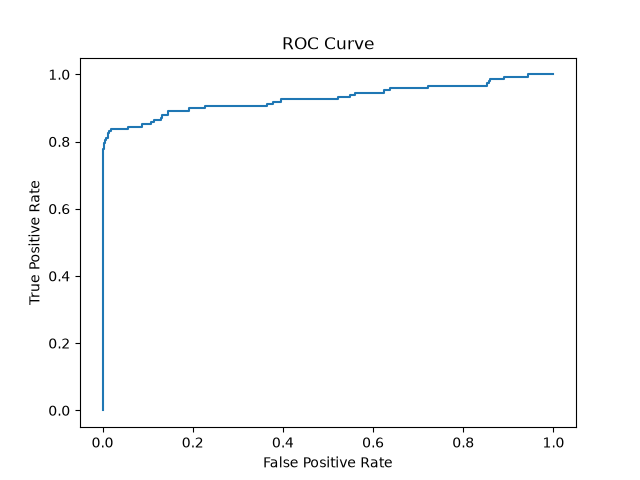
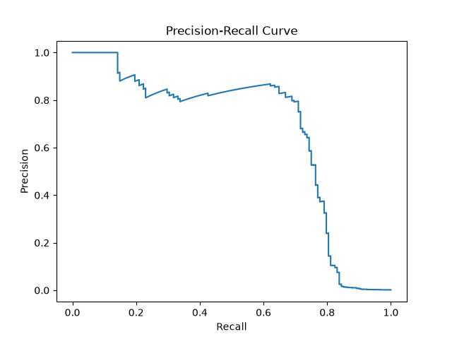
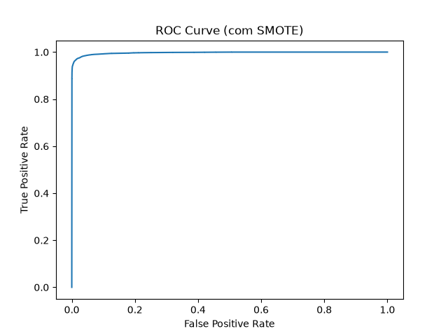
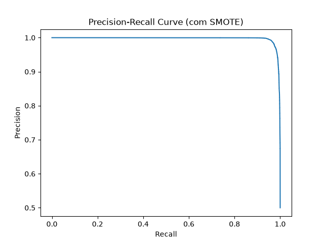
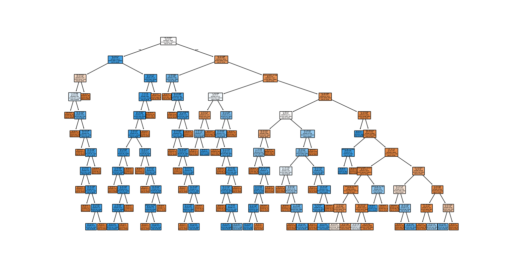
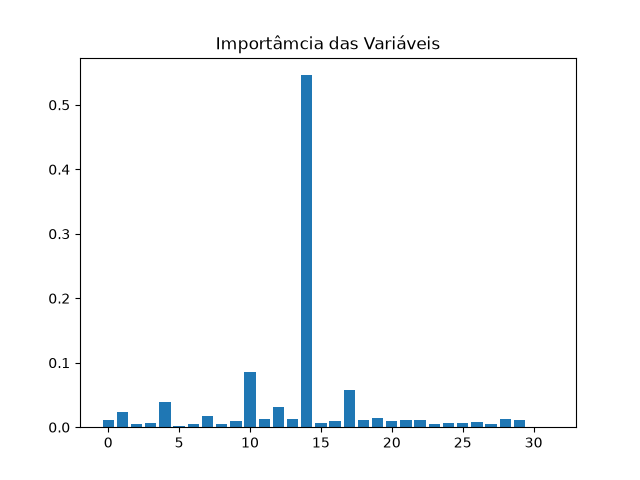
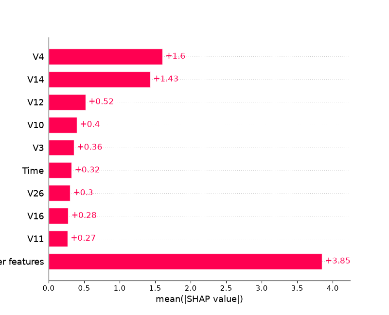

# Projeto final: detecção de fraudes em transações financeiras 💳
O projeto final consiste em um estudo de caso de detecção de fraudes em transações financeiras. O objetivo é aplicar os conhecimentos adquiridos ao longo do curso para desenvolver um modelo de machine learning capaz de identificar transações suspeitas.
>Vide [Projeto Final](./Projeto_Final.py)

## Dataset utilizado: 
Um dataset público de transações de cartão de crédito com marcação de fraudes, hospedado no Kaggle e em repositórios acadêmicos, é considerado um padrão de referência em projetos de detecção de fraude financeira com machine learning.
> Por se tratar de um arquivo muito grande, é necessário baixar o arquivo como `creditcard.csv` na pasta [Complementos](./Complementos/) <br>
>[link para download do arquivo original](https://www.kaggle.com/datasets/mlg-ulb/creditcardfraud)


## Problema de classificação desbalanceada:
No dataset, a coluna class indica se uma transação é **fraudulenta (1)** ou **não fraudulenta (0)**. Porém a imensa maioria dos dados registrados são de transações **NÃO fraudulentas**, gerando um problema de desbalanceamento nos dados que pode fazer com que modelos ignorem os casos de fraude. Em casos como este a `Acurácia` retornaria um valor alto indicando que o modelo acerta 99,82% das vezes, o que aparenta ser um bom número, mas na prática estaria errando 100% das vezes necessárias.

- Verificação:
  ```python
  print(df["Class"].value_counts(normalize=True))
  ```
| Class | Retorno | Porcentagem |
| -- | -- | -- |
| 0 | 0.998273 | 99,82% |
| 1 | 0.001727 | 0,17% |

## Feature Engineering:
É o processo de transformar dados brutos em variáveis (features) úteis e informativas para modelos de machine learning, aumentando a capacidade do algoritmo de identificar padrões e gerar previsões mais precisas. Em outras palavras, é a arte de preparar os dados de forma inteligente para que o modelo aprenda melhor.

- **Aplicando logaritmo:**
  ```python
  df["Amount_log"] = np.log1p(df["Amount"])
  ```
  > cria uma nova feature `Amount_log` transformada que representa o valor da transação `Amount` em escala logarítmica, ajudando a reduzir o impacto de grandes variações nos valores originais.

- **Normalização estatística:**
  ```python
  scaler = StandardScaler()
  df["Amount_scaled"] = scaler.fit_transform(df[["Amount"]])
  ```
  > calcula a média e o desvio padrão dos valores e, em seguida, transforma cada valor para uma escala padronizada, onde a média passa a ser 0 e o desvio padrão 1. Isso gera a nova coluna Amount_scaled, que contém os valores ajustados. Esse processo é importante porque muitos algoritmos de machine learning são sensíveis à escala das variáveis: ao padronizar, evitamos que atributos com magnitudes maiores dominem o treinamento e garantimos que todas as features tenham peso comparável.

- **Preparação dos dados para treino e teste:**
  ```python
  x = df.drop("Class", axis=1)
  y = df["Class"]

  x_train, X_test, y_train, y_test = train_test_split(
    x, y, stratify=y, test_size=0.3, random_state=42
  )
  ```
  > separa os dados em treino e teste de forma balanceada, para que o modelo aprenda com 70% dos exemplos e seja avaliado nos 30% restantes sem perder a proporção entre classes.

## Regressão Logística:

```python
model = LogisticRegression(max_iter=1000)
model.fit(x_train, y_train)
y_pred = model.predict(x_test)

print("\n\033[34mClassificantion Report:\033[0m")
print(classification_report(y_test, y_pred))
```
> ajusta um modelo de classificação binária e obtem as previsões sobre o conjunto de teste.
```txt
Classificantion Report:
              precision    recall  f1-score   support

           0       1.00      1.00      1.00     85295
           1       0.86      0.64      0.73       148

    accuracy                           1.00     85443
   macro avg       0.93      0.82      0.87     85443
weighted avg       1.00      1.00      1.00     85443
```

## Curva de ROC:
A **curva ROC (Receiver Operating Characteristic)** é uma ferramenta gráfica usada para avaliar modelos de classificação binária. Ela mostra a relação entre duas taxas em diferentes limiares de decisão:
- **Taxa de Falsos Positivos (FPR)**: proporção de exemplos negativos que o modelo classificou incorretamente como positivos.
- **Taxa de Verdadeiros Positivos (TPR)**: proporção de exemplos positivos que o modelo classificou corretamente como positivos (também chamada de sensibilidade ou recall).  
  
Ao variar o limiar de probabilidade (por exemplo, decidir se uma transação é fraude quando a probabilidade é maior que 0.5, ou 0.3, ou 0.7), o modelo gera diferentes pares de FPR e TPR. Esses pontos são conectados formando a curva ROC.

```python
y_probs = model.predict_proba(x_test)[:,1]

fpr, tpr, _ = roc_curve(y_test, y_probs)

plt.plot(fpr, tpr)
plt.title("ROC Curve")
plt.xlabel("False Positive Rate")
plt.ylabel("True Positive Rate")
plt.show()

print("AUC:", roc_auc_score(y_test, y_probs))
```
> avalia o desempenho do modelo de regressão logística usando a curva ROC e a métrica AUC


> Interpretação
> - Um modelo perfeito teria uma curva que sobe imediatamente até TPR = 1 com FPR = 0 (canto superior esquerdo).
> - Um modelo aleatório gera uma linha diagonal (de 0,0 até 1,1).
> - Quanto mais a curva se aproxima do canto superior esquerdo, melhor o desempenho.
> - O AUC (Area Under the Curve) resume essa curva em um único número entre 0 e 1:
> - AUC = 0.5: modelo não melhor que um chute aleatório.
> - AUC próximo de 1: excelente capacidade de distinguir entre classes.

## Curva de Precision-Recall

- **Precisão (Precision):** entre todas as previsões positivas, quantas realmente eram positivas.
- **Recall (Sensibilidade):** entre todas as instâncias positivas, quantas o modelo conseguiu identificar.

```python
precision, recall, _ = precision_recall_curve(y_test, y_probs)

plt.plot(recall, precision)
plt.title("Precision-Recall Curve")
plt.xlabel("Recall")
plt.ylabel("Precision")
plt.show()
```
> Constrói e exibe a curva Precision-Recall, que é uma forma de avaliar modelos de classificação, especialmente em cenários de dados desbalanceados.


### Interpretação:
- Uma curva próxima do canto superior direito indica bom desempenho (alta precisão e alto recall).
- Em datasets desbalanceados, essa curva é mais informativa que a ROC, pois foca diretamente na qualidade das previsões da classe positiva (fraude).

## Undersampling & Oversampling
São duas técnicas usadas para lidar com datasets desbalanceados, ou seja, quando uma classe aparece muito mais vezes que a outra (como em problemas de fraude, onde transações legítimas são muito mais comuns que fraudulentas).

### Undersampling
- **O que é:** reduzir o número de exemplos da classe majoritária (não fraude, por exemplo) para equilibrar com a classe minoritária.
- **Vantagem:** diminui o tempo de treino e evita que o modelo seja enviesado pela classe dominante.
- **Desvantagem:** pode descartar dados úteis, perdendo informação importante.
- **Exemplo:** se há 100.000 transações legítimas e 1.000 fraudulentas, você seleciona apenas 1.000 legítimas para treinar junto com as 1.000 fraudulentas.

```python
fraudes = df[df["Class"] == 1]
normais = df[df["Class"] == 0].sample(len(fraudes), random_state=42)

df_under = pd.concat([fraudes, normais])
```

---

### Oversampling
- **O que é:** aumentar o número de exemplos da classe minoritária, duplicando ou criando novos exemplos sintéticos.
- **Vantagem:** mantém todos os dados da classe majoritária e dá mais representatividade à classe rara.
- **Desvantagem:** pode gerar overfitting se apenas duplicar dados, ou criar exemplos artificiais que não refletem a realidade.
- **Exemplo:** usar técnicas como SMOTE (Synthetic Minority Over-sampling Technique) para gerar transações fraudulentas sintéticas até equilibrar com as legítimas.

```python
smote = SMOTE(random_state=42)
x_res, y_res = smote.fit_resample(x, y)
```

### Treinando Novamente o Modelo Após o Oversampling
```python
# Divisão treino/teste no dataset balanceado
x_train_res, x_test_res, y_train_res, y_test_res = train_test_split(
    x_res, y_res, stratify=y_res, test_size=0.3, random_state=42
)

model_res = LogisticRegression(max_iter=1000)
model_res.fit(x_train_res, y_train_res)
y_pred_res = model_res.predict(x_test_res)

# Relatório de classificação
print("\n\033[34mClassification Report (com SMOTE):\033[0m")
print(classification_report(y_test_res, y_pred_res))

# Probabilidades para métricas
y_probs_res = model_res.predict_proba(x_test_res)[:,1]

# Curva ROC
fpr_res, tpr_res, _ = roc_curve(y_test_res, y_probs_res)
plt.plot(fpr_res, tpr_res)
plt.title("ROC Curve (com SMOTE)")
plt.xlabel("False Positive Rate")
plt.ylabel("True Positive Rate")
plt.show()

print("AUC (com SMOTE):", roc_auc_score(y_test_res, y_probs_res))

# Curva Precision-Recall
precision_res, recall_res, _ = precision_recall_curve(y_test_res, y_probs_res)
plt.plot(recall_res, precision_res)
plt.title("Precision-Recall Curve (com SMOTE)")
plt.xlabel("Recall")
plt.ylabel("Precision")
plt.show()
```
> Pega o dataset já balanceado com SMOTE, divide em treino e teste, treina um modelo de regressão logística e depois avalia seu desempenho mostrando o relatório de classificação, a curva ROC com AUC e a curva Precision-Recall, permitindo comparar como o modelo se comporta após o oversampling.




## Modelo com Random Forest
```python
  rf = RandomForestClassifier(
    n_estimators=50,
    max_depth=10,
    class_weight="balanced",
    n_jobs=-1,
    random_state=42
  )

  rf.fit(x_train, y_train)

  y_pred_rf = rf.predict(x_test)

  print(classification_report(y_test, y_pred_rf))
```


## Pipeline com padronização e ajuste de limiar

Um `Pipeline` organiza várias etapas do processamento e do treinamento em uma única estrutura. Neste exemplo, os dados são padronizados pelo `StandardScaler` antes de serem enviados ao modelo de regressão logística.

```python
  pipeline = Pipeline([
    ("scaler", StandardScaler()),
    ("model", LogisticRegression(max_iter=1000))
  ])

  pipeline.fit(x_train, y_train)

  y_pred = pipeline.predict(x_test)
  y_probs_pipeline = pipeline.predict_proba(x_test)[:, 1]

  threshold = 0.3

  y_pred_custom = (y_probs_pipeline > threshold).astype(int)

  print(classification_report(y_test, y_pred_custom))
```
> O limiar padrão dos classificadores geralmente é 0.5. Ao utilizar 0.3, o modelo passa a considerar uma transação como fraude com uma probabilidade menor.  
>É importante utilizar as probabilidades geradas pelo próprio pipeline. No script original, y_probs foi calculado anteriormente pelo modelo model, e não pelo pipeline.

Essa alteração tende a aumentar o recall, identificando mais fraudes, mas também pode aumentar o número de falsos positivos. Em detecção de fraudes, essa pode ser uma escolha adequada quando deixar uma fraude passar é mais prejudicial do que analisar uma transação legítima.

## Modelo XGBoost
> O XGBoost é um algoritmo baseado em árvores de decisão construídas sequencialmente. Cada nova árvore tenta corrigir os erros cometidos pelas árvores anteriores.

```python
  xgb = XGBClassifier(
    scale_pos_weight=10,
    eval_metric="logloss",
    random_state=42
  )

  xgb.fit(x_train, y_train)

  y_pred_xgb = xgb.predict(x_test)

  print(classification_report(y_test, y_pred_xgb))
```
>O parâmetro scale_pos_weight aumenta a importância da classe minoritária durante o treinamento. Isso é útil neste dataset, pois existem muito mais transações normais do que fraudulentas.

O XGBoost pode apresentar bom desempenho em dados tabulares e consegue identificar relações não lineares entre as variáveis.

## Importância das Variáveis
O XGBoost fornece a importância estimada de cada variável por meio do atributo feature_importances_.

```python
importancias = xgb.feature_importances_

plt.bar(x.columns, importancias)
plt.xticks(rotation=90)
plt.title("Importância das variáveis")
plt.ylabel("Importância")
plt.show()
```


>Esse gráfico ajuda a identificar quais atributos contribuíram mais para as decisões do modelo. Entretanto, a importância global não explica o motivo de uma transação específica ter sido classificada como fraude.

## Ajuste de hiperparâmetros com GridSearchCV
Hiperparâmetros são configurações definidas antes do treinamento do modelo. O GridSearchCV testa diferentes combinações e seleciona aquela que apresenta o melhor resultado de acordo com uma métrica.

```python
param_grid = {
  "max_depth": [3, 5],
  "n_estimators": [50, 100]
}

grid = GridSearchCV(
  XGBClassifier(
    eval_metric="logloss",
    random_state=42
  ),
  param_grid,
  scoring="recall",
  cv=3,
  n_jobs=-1
)

grid.fit(x_train, y_train)

print("Melhores parâmetros:", grid.best_params_)
print("Melhor recall:", grid.best_score_)
```
Neste caso:

- `max_depth` define a profundidade máxima das árvores.
- `n_estimators` define a quantidade de árvores.
- `scoring="recall"` faz o processo priorizar a identificação de fraudes.
- `cv=3` divide os dados de treinamento em três partes para realizar a validação cruzada.
  
>A escolha da métrica é importante. Como o objetivo principal é encontrar fraudes, o recall da classe positiva pode ser mais relevante do que a acurácia

## Explicabilidade com SHAP
O SHAP ajuda a explicar como cada variável influenciou a previsão do modelo. Ele pode mostrar tanto a importância geral das variáveis quanto a influência delas em uma observação específica.

```python
explainer = shap.Explainer(xgb, x_train)
shap_values = explainer(x_test.iloc[:100])

shap.plots.bar(shap_values)
```

> O gráfico de barras apresenta a importância média das variáveis nas previsões analisadas.